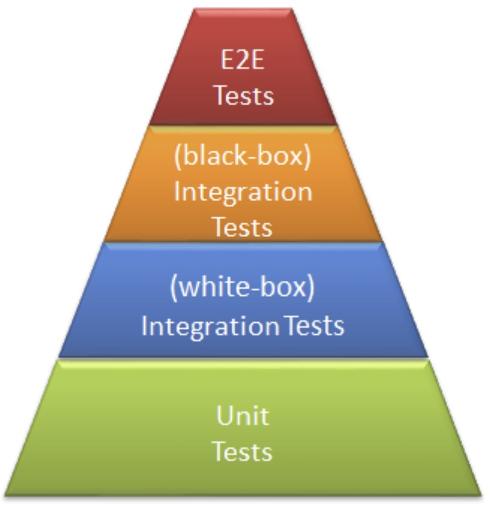

# Grundlagen Testen

## Tests aus der Informatik

## 3 Arten von Testing

### Integration Test
Integrationstests sind ein wichtiger Teil des Softwaretestprozesses, bei dem verschiedene Module oder Komponenten einer Anwendung zusammengeführt werden, um sicherzustellen, dass sie ordnungsgemäß miteinander funktionieren. 

Zusammengefasst dienen Integrationstests dazu, sicherzustellen, dass die einzelnen Teile einer Software effektiv zusammenarbeiten, um die gewünschte Funktionalität zu erreichen, bevor die Anwendung in der Produktionsumgebung eingesetzt wird.

### End-2-End Test
End-to-End-Tests (E2E-Tests) sind eine Art von Softwaretests, bei denen das gesamte System oder eine Anwendung von Anfang bis Ende auf ihre korrekte Funktionsweise überprüft wird. Dabei simulieren sie typischerweise die tatsächliche Nutzung der Software durch Benutzer, indem sie verschiedene Teile der Anwendung integrieren und testen, um sicherzustellen, dass alle Komponenten nahtlos zusammenarbeiten.

Diese Tests zielen darauf ab, sicherzustellen, dass das gesamte System ordnungsgemäß funktioniert und die beabsichtigten Geschäftsanforderungen erfüllt, indem sie echte Benutzerinteraktionen nachahmen. Wenn während eines End-to-End-Tests Probleme auftreten, können sie auf Schwachstellen oder Fehler im System hinweisen, die behoben werden müssen, um die Software zuverlässig und fehlerfrei zu machen. E2E-Tests sind daher ein wichtiger Bestandteil des Qualitätssicherungsprozesses in der Softwareentwicklung.

### Exploration Test
In unserer Pyramide nicht zu sehen, ist noch das Explorative Testing, welches sich an der Spitze der Pyramide befindet.

Exploratives Testen ist ein Ansatz im Softwaretesten, bei dem Tester ihre Kreativität und ihr Wissen über die Anwendung nutzen, um unerwartete Fehler aufzudecken.

Zusammengefasst nutzt exploratives Testen die Fähigkeiten und das Wissen der Tester, um auf kreative Weise Fehler in einer Anwendung aufzudecken, wodurch auch unerwartete Schwachstellen, Bugs oder Glitches identifiziert werden können, die durch traditionelle Testmethoden möglicherweise nicht erfasst würden.

## Beispiel eines Software-Fehlers:
Stell dir vor, du besuchst eine Online-Shopping-Website. Du legst einige Artikel in deinen Warenkorb, aber wenn du zur Kasse gehen möchtest, merkst du, dass die Artikel im Warenkorb nicht richtig aktualisiert werden. Manchmal verschwinden Dinge, die du hinzugefügt hast, oder die Preise stimmen nicht mehr. Das kann zu Verwirrung führen und dazu, dass du mehr bezahlst als erwartet.

## Beispiel eines Software-Mangels:
Stell dir vor, du hast eine neue Software heruntergeladen, um deine Finanzen zu verwalten. Du öffnest die Anwendung und siehst viele Funktionen, aber es gibt keine klaren Anleitungen oder Hilfen, wie du sie nutzen kannst. Du fühlst dich verloren und weißt nicht, wie du die verschiedenen Optionen verwenden kannst, um deine finanziellen Ziele zu erreichen.

## Beispiel für hohen Schaden bei einem Software-Fehler:
Nehmen wir an, du bist in einem Krankenhaus, und die Ärzte verwenden ein computergestütztes Gerät, um deine Vitalwerte zu überwachen. Doch plötzlich gibt das Gerät falsche Messwerte aus oder löst wichtige Alarme nicht rechtzeitig aus. Dies könnte dazu führen, dass die Ärzte falsche Entscheidungen treffen und deine Gesundheit gefährdet wird. In den schlimmsten Fällen könnte das Leben der Patienten auf dem Spiel stehen, und das Krankenhaus sowie die Entwickler der Software könnten rechtliche Konsequenzen tragen müssen.

## Table
Ist Resultat ist bei uns leer da wir keine wirklichen Tests haben.

<table>
  <tr>
    <th>Testfall</th>
    <th>Erwartetes Resultat</th>
    <th>Ist Resultat</th>
  </tr>
  <tr>
    <td>< 15'000</td>
    <td>Kein Rabatt</td>
    <td>-</td>
  </tr>
  <tr>  
    <td>≥ 15'000 && < 20'000</td>
    <td>5% Rabatt</td>
    <td>-</td>
  </tr>
  <tr>  
    <td>≥ 20'000 && < 25'000</td>
    <td>7% Rabatt</td>
    <td>-</td>
  </tr>
  <tr>  
    <td>≥ 25'000</td>
    <td>8.5% Rabatt</td>
    <td>-</td>
  </tr>
</table>

<table>
  <tr>
    <th>Testfall</th>
    <th>Erwartetes Resultat</th>
    <th>Ist Resultat</th>
  </tr>
  <tr>
    <td>998</td>
    <td>Kein Rabatt</td>
    <td>-</td>
  </tr>
  <tr>  
    <td>23'747</td>
    <td>7% Rabatt</td>
    <td>-</td>
  </tr>
  <tr>  
    <td>-999'999</td>
    <td>Input Error</td>
    <td>-</td>
  </tr>
  <tr>  
    <td>kdajfk</td>
    <td>Input Error</td>
    <td>-</td>
  </tr>
  <tr>  
    <td>0</td>
    <td>Kein Rabatt</td>
    <td>-</td>
  </tr>
  <tr>  
    <td>Select FROM * ...</td>
    <td>Input Error</td>
    <td>-</td>
  </tr>
  <tr>  
    <td>15'000</td>
    <td>5% Rabatt</td>
    <td>-</td>
  </tr>
</table>